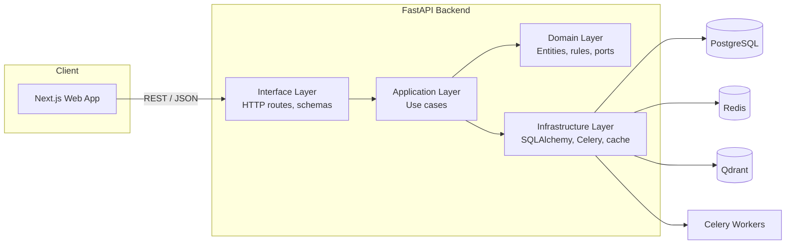

# Architecture

## 1. Overview

Quantix AI is split into two deployable services plus shared infrastructure:

- **`apps/api`** — FastAPI backend. Owns all business logic, persistence,
  and (in later milestones) AI agent orchestration.
- **`apps/web`** — Next.js frontend. Talks to the API exclusively over
  HTTP/JSON; holds no business logic of its own.
- **Infrastructure** — PostgreSQL (system of record), Redis (cache +
  Celery broker/result backend), Qdrant (vector search for embeddings/RAG),
  DuckDB (embedded OLAP engine backing dataset storage/preview — see
  §3b).



## 2. Backend: Clean Architecture layering

The backend is organized in four layers with a strict dependency rule:
**outer layers depend on inner layers, never the reverse.**

```
interface/         →  application/  →  domain/
                       infrastructure/ →  domain/
```

| Layer | Responsibility | May import |
|---|---|---|
| `domain/` | Entities, value objects, repository *interfaces* (ports), domain exceptions, business rules. Plain Python — no FastAPI, no SQLAlchemy. | Nothing outside `domain/` |
| `application/` | Use cases that orchestrate domain objects to fulfill a request. Defines interfaces for things it needs from the outside world (e.g. an email sender), implemented later by infrastructure. | `domain/` |
| `infrastructure/` | Concrete implementations of domain ports: SQLAlchemy repositories, Celery tasks, Redis cache, password hashing. This is where every third-party library lives. | `domain/`, `application/` |
| `interface/` | FastAPI routers, Pydantic request/response schemas, dependency wiring. The only layer that knows HTTP exists. | all of the above |

Why: business rules (domain) are testable in complete isolation, with no
database or web framework required. Swapping PostgreSQL for another store,
or FastAPI for another web framework, touches `infrastructure/` and
`interface/` only — `domain/` and most of `application/` are untouched.

`core/` is the composition root: `core/config.py` (typed settings from
env vars), `core/container.py` (constructs and hands out singletons — the
engine, the session factory), `core/logging.py` (structured logging setup).

### Request lifecycle

1. `interface/api/v1/routes/*.py` receives the HTTP request, validates the
   body against a Pydantic schema.
2. The route handler calls into `application/use_cases/*`, passing
   domain-typed arguments (never raw dicts).
3. The use case operates on `domain/entities` and calls repository ports
   (`domain/repositories/base.py`) to persist changes.
4. `infrastructure/database/repositories/*` — the concrete implementation
   injected via `core/container.py` — translates between ORM rows and
   domain entities.
5. Domain exceptions (`domain/exceptions/base.py`) propagate up
   untouched; `interface/api/exception_handlers.py` maps them to HTTP
   status codes at the boundary — use-case code never imports `fastapi`.

## 3. Multi-tenancy

Every tenant-scoped table carries an indexed `tenant_id` foreign key
(`infrastructure/database/models/base.py::TenantScopedMixin`). Tenant
isolation is enforced at the repository layer — no route handler or use
case is trusted to remember the filter. `users.email` is unique *per
tenant*, not globally, so login takes a tenant slug alongside credentials
(see ADR-0002). Postgres row-level security as defense-in-depth is a
tracked follow-up, not yet implemented.

## 3a. Authentication & authorization (milestone 2)

Full design reasoning lives in
[ADR-0002](adr/0002-authentication-and-multi-tenancy.md); this is the
shape of it.

**Tokens.** Access tokens are short-lived JWTs (HS256, `core.config`
`access_token_expire_minutes`) verified by signature alone — no DB hit per
request. Refresh tokens are opaque random strings, SHA-256-hashed before
storage in `refresh_tokens`, so they can be revoked; every use rotates the
token (old one revoked, new one issued), and presenting an
already-revoked token triggers reuse detection that revokes the entire
token family for that user.

**Request flow for a protected route:**
`interface/api/v1/dependencies/auth.py::get_current_user` decodes the
bearer token via the `TokenService` port, loads the user through
`UserRepository`, and rejects inactive users or a tenant/user mismatch.
`require_role(min_role)` wraps that to add an RBAC check using
`User.has_at_least()` (domain layer, `owner > admin > analyst > viewer`).

**Use cases** (`application/use_cases/`): `RegisterUserUseCase` (creates a
new tenant + owner), `LoginUserUseCase`, `RefreshAccessTokenUseCase`,
`LogoutUserUseCase`, `OAuthLoginUseCase` (find-by-provider-identity, or
provision a new tenant on first sign-in). Each depends only on ports
(`PasswordHasher`, `TokenService`, repository interfaces, `AuditLogger`)
defined in `application/interfaces/` — concrete implementations
(Argon2, JWT, SQLAlchemy, DB-backed audit log) live in `infrastructure/`
and are wired at `core/container.py`.

**OAuth** (Google/GitHub/Microsoft): authorization-code flow via
provider-specific `httpx` clients under `infrastructure/security/oauth/`,
all implementing the `OAuthProviderClient` port. CSRF protection uses a
signed, short-TTL "state" JWT rather than server-side session storage.

**Audit log.** Every auth-relevant event (register, login
success/failure, logout, OAuth login, token refresh, reuse detection)
goes through the `AuditLogger` port into an append-only `audit_logs`
table with a loose JSON `metadata` column, so new event types don't need
a migration.

## 3b. Data connectors & datasets (milestone 3)

Full design reasoning lives in
[ADR-0003](adr/0003-data-connector-layer.md); this is the shape of it.

**Two entities, not one.** A `DataSource` is a reusable connection or
uploaded file (config + Fernet-encrypted secrets, `credential_encryption_key`
deliberately separate from the JWT `secret_key`). A `Dataset` is one
materialized, queryable table pulled from a `DataSource` — one connection
can back many datasets, and re-syncing a dataset never re-asks for
credentials.

**One `Connector` Protocol, four implementations, eleven source types.**
`application/interfaces/connector.py` defines
`test_connection() / discover() / extract()`; `extract()` always returns a
`pyarrow.Table`, the shared format between every connector and the
storage layer (a documented, narrow exception to application/infrastructure
layering — see ADR-0003). `infrastructure/connectors/`:
`SqlDatabaseConnector` (Postgres/MySQL/SQL Server/SQLite/Snowflake, one
class parameterized by dialect), `FileConnector` (CSV/Excel/JSON/Parquet),
`BigQueryConnector`, `GoogleSheetsConnector`. `ConnectorRegistry` maps
`SourceType` → connector instance and is the sole place a new source type
gets registered.

**Ingestion: one code path, two entry points.** `SyncDatasetUseCase`
exposes `execute()` (create + ingest inline — file uploads, small syncs)
and `create_pending()` + `resync()` (create a `PENDING` row immediately,
ingest later — the async/Celery path). Both funnel into a private `_run()`
that calls the shared `ingest_into_dataset()` helper
(`application/use_cases/_ingestion.py`), so there is exactly one place
that knows how to go from a connector to a stored, schema-annotated
dataset. Blocking connector I/O (sync SQLAlchemy/pandas calls — several
of the five SQL dialects have no mature async driver) is offloaded via
`anyio.to_thread.run_sync`, usable identically from a FastAPI request
handler or inside a Celery task's own `asyncio.run()` loop.

**Celery tasks own their own engine.** `infrastructure/celery/tasks/dataset_sync.py`
builds a short-lived engine/session per task invocation and constructs its
own `SyncDatasetUseCase`, since a Celery worker is a separate OS process
from the API and can't share its request-scoped session.

**Storage.** `LocalFileStorage` persists raw uploaded bytes;
`DuckDBDatasetStorage` writes ingested tables as Parquet and serves
previews via DuckDB's `read_parquet()` with `LIMIT` pushdown. Both are
single-instance-local implementations behind `FileStorage`/`DatasetStorage`
ports — an S3/GCS-backed implementation is a tracked follow-up before
horizontal scaling.

## 4. Frontend structure

```
apps/web/src/
  app/            # App Router: routes, layouts, root providers
    (auth)/       # /login, /register — shared centered-card layout, no URL segment of its own
    auth/callback/  # /auth/callback — a REAL segment (OAuth fragment handoff lands here, see ADR-0005)
    (app)/        # Protected app shell — /home, /data-sources, /datasets, /chat
  components/ui/  # shadcn/ui-style primitives — presentational, no data fetching
  features/       # Feature modules (auth/, connectors/, dashboards/, chat/...) — colocate components, hooks, and API calls per feature
  lib/            # api-client.ts (typed fetch wrapper + authFetch), cn() utility
  stores/         # Zustand — ui-store.ts (client-only UI state) and auth-store.ts (session state — a documented exception, see below)
  hooks/          # Shared React hooks
  types/          # Types mirroring backend Pydantic schemas
```

State is deliberately split: **TanStack Query** owns everything that comes
from the server (fetch, cache, invalidate, refetch-on-focus); **Zustand**
owns ephemeral UI state that never touches the network (sidebar collapsed,
command palette open). Mixing the two is the most common state-management
bug in React apps this size, so the boundary is enforced by convention and
called out in code review. `stores/auth-store.ts` is the one deliberate
exception — see §4a.

## 4a. Frontend authentication & app shell (milestone 5)

Full design reasoning lives in
[ADR-0005](adr/0005-frontend-auth-and-session.md); this is the shape of it.

**Session state.** `stores/auth-store.ts` (Zustand, persisted to
`localStorage`) holds the access/refresh token pair and the current user.
It's read outside of React components — by `lib/api-client.ts`'s
`authFetch` and by the app shell's route guard — which is why it isn't a
TanStack Query cache like every other piece of server data.

**API client.** `authFetch` wraps the milestone-1 `apiFetch`: attaches the
current bearer token, and on a 401 calls `POST /auth/refresh` once
(de-duplicated across concurrent callers) before retrying. Feature modules
call `authFetch` for anything that needs a session; `apiFetch` directly
only for the pre-session calls (`register`, `login`, OAuth authorize URL).

**Routes.** `/login` and `/register` (`app/(auth)/`, `react-hook-form` +
`zod`, validation mirroring the backend's Pydantic constraints) and
`/auth/callback` (parses the OAuth redirect fragment — see ADR-0002 and
ADR-0005 for why it's a fragment, and why this route can't be a
`useSearchParams()` page). `app/(app)/layout.tsx` guards everything under
it client-side (redirects to `/login?next=...` if there's no token once
the persisted store has hydrated) and renders the sidebar/top-bar shell
every future authenticated page lives inside.

## 4b. Data source & dataset management UI (milestone 6)

Full design reasoning lives in
[ADR-0006](adr/0006-frontend-connector-and-dataset-ui.md); this is the
shape of it.

**Routes.** `/data-sources` (list, add, test, delete) and
`/data-sources/[id]` (test, discover tables, pull a table into a dataset)
cover the milestone-3 connector layer's live-source path;
`/datasets` (list, resync, delete) and `/datasets/upload` (file upload)
cover the rest, with `/datasets/[id]` showing schema + an `ag-grid`
preview.

**Dynamic connection-config form.** `features/connectors/source-type-
fields.ts` maps each connectable `SourceType` to the config/secret fields
its backend connector actually reads — `app/(app)/data-sources/new/page.tsx`
renders whatever that map says for the selected type and splits submitted
values into `config` vs. `secrets` accordingly. One form, seven source
shapes; see ADR-0006 for why this form is the one place in the app that
doesn't use `react-hook-form` + `zod`.

**Data layer.** `features/connectors/api.ts` (typed calls, including a
`FormData`-aware upload) and `hooks.ts` (TanStack Query, one hook per
operation, invalidating the relevant list/detail query keys on mutation
success rather than hand-patching the cache).

## 4c. Chat interface (milestone 7)

Full design reasoning lives in
[ADR-0007](adr/0007-frontend-chat-interface.md); this is the shape of it.

**Routes.** `/chat` (conversation list), `/chat/new` (title + optional
scope to a `status === "ready"` dataset), `/chat/[id]` (the thread: message
list, composer, and an agent-activity sidebar).

**No streaming client.** `POST /conversations/{id}/messages` runs the
backend's LangGraph turn synchronously and can take tens of seconds (see
§5 and ADR-0004) — there's no `EventSource`, websocket, or job-polling on
the frontend to match, because there's nothing on the backend yet to
stream from.

**Optimistic send.** `features/chat/hooks.ts`'s `useSendMessage` appends
the user's message to the `messages` query cache in `onMutate` (the
standard TanStack Query optimistic-update recipe) so the thread doesn't
sit empty for the whole round trip, rolls it back on error, and
invalidates `messages`/`agent-runs` on success rather than hand-patching
the response in — the same "refetch, don't merge" pattern §4b's connector
hooks use.

**Agent activity panel.** `features/chat/agent-activity-panel.tsx` lists
`GET .../agent-runs` for the open conversation, filtered to exclude
`AgentType.SUPERVISOR` (routing-only, never user-facing) — the one place
in this milestone's UI that surfaces which of the twelve specialists
actually worked on a given turn.

## 5. AI agent orchestration (milestone 4)

Full design reasoning lives in [ADR-0004](adr/0004-ai-agent-orchestration.md);
this is the shape of it.

**Conversation model.** A `Conversation` (optionally scoped to one
`Dataset`) contains `Message`s (`user`/`assistant`/`system`). Each
assistant `Message` is produced by zero or more specialized-agent
invocations recorded as `AgentRun` rows (agent type, status, token
counts, latency, tool calls) — the conversational content and the
execution/observability record are deliberately separate tables.

**Supervisor + specialist graph, built with LangGraph.** Every turn
starts at a `supervisor` node, which is forced (via tool-calling with
`tool_choice="any"`) to either `route_to_agent` (hand off to one of the
twelve specialists) or `finish` (respond to the user). Specialist nodes
return to the supervisor when done, which may route again or finish —
bounded by `agent_max_supervisor_iterations` as a circuit breaker. The
twelve agent types are covered by three real node implementations, not
twelve: `PromptedAgentNode` (a config-driven LLM tool-calling loop) covers
ten of them via per-type system prompts (`infrastructure/agents/configs.py`);
`AutoMLAgentNode` trains real scikit-learn models (the LLM only picks the
target column); `DataIngestionAgentNode` wraps milestone 3's
`SyncDatasetUseCase.resync` rather than reasoning in text. This mirrors
the milestone-3 pattern of consolidating variation behind a small number
of real classes.

**LLM port.** `application/interfaces/llm_client.py` defines
`LLMClient.complete()` (message history in, text-and/or-tool-calls out) —
`infrastructure/llm/anthropic_client.py` is the only module that knows
the Anthropic Messages API's content-block shapes. Every agent node
speaks only the port's `LLMMessage`/`ToolSpec` types.

**Dependency injection into a singleton graph.** The compiled LangGraph
graph is built once in `core/container.py` (compiling a `StateGraph`
isn't free, and every node closure only captures the stateless
`LLMClient`). Request-scoped dependencies — dataset storage, other use
cases — are threaded through LangGraph's `RunnableConfig.configurable`
dict at `ainvoke()` time instead of being captured in a node closure, via
`AgentRunContext` (`application/interfaces/agent_graph.py`).

**Shared dataset tools, sandboxed to varying degrees.**
`infrastructure/agents/tools.py` offers `get_dataset_schema`,
`query_dataset` (read-only SQL via DuckDB), `run_python_analysis`
(pandas/numpy `exec()` with a restricted builtins allowlist — a
best-effort sandbox, not a hard security boundary), and `forecast_series`
(linear-trend extrapolation). Available whenever the conversation's
dataset is `READY`; otherwise agents are told plainly that no dataset is
attached rather than guessing.

**Synchronous, not Celery-backed.** Unlike milestone 3's large dataset
syncs, a conversation turn is expected to finish within one HTTP
request/response cycle — `SendMessageUseCase` runs the graph inline and
returns the assistant's `Message` plus every `AgentRun` in the response.
Streaming the reply token-by-token (SSE) is a deliberate, documented
follow-up, not what's built here.

## 6. Data stores

| Store | Role |
|---|---|
| PostgreSQL | System of record: tenants, users, connectors, dashboards, model metadata |
| DuckDB | Embedded OLAP for ad-hoc queries over ingested datasets — avoids round-tripping large analytical scans through Postgres |
| Redis | Response/query cache + Celery broker & result backend |
| Qdrant | Vector store for embeddings powering RAG-based conversational analytics |

## 7. Observability

Structured JSON logging (`structlog`) in staging/production, human-readable
console output in development. Every request gets a correlation ID
(`X-Request-ID`) bound to the log context via
`infrastructure/logging/middleware.py`. Health endpoints distinguish
liveness (`/health/live` — process is up) from readiness (`/health/ready`
— dependencies are reachable), matching Kubernetes probe semantics.
